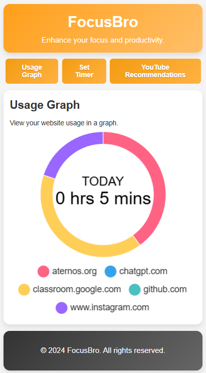
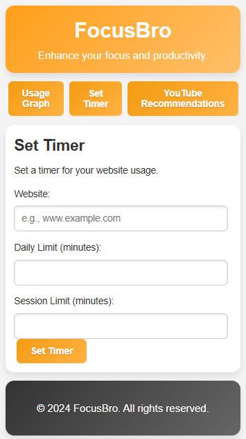

# FocusBro


FocusBro is a Chrome extension designed to help users manage their time online by setting limits on website usage and removing YouTube recommendations. It aims to improve productivity by minimizing distractions and promoting focused browsing sessions.

## Features

- **Website Usage Tracking & Graph:** Track the amount of time spent on various websites and visualize it with a dynamic doughnut chart.
- **Set Timers:** Set daily and session-based time limits for specific websites.
- **YouTube Recommendations Toggle:** Remove YouTube recommendations to avoid distractions.

## Installation

1. **Clone the repository:**
    ```bash
    git clone https://github.com/ArshdKhan/FocusBro.git
    ```

2. **Open Chrome and go to the Extensions page:**
    ```bash
    chrome://extensions/
    ```

3. **Enable Developer Mode:**
    Toggle the switch in the top right corner.

4. **Load Unpacked Extension:**
    Click the "Load unpacked" button and select the cloned repository folder.

## Usage

1. **Set Website Timer:**
    - Enter the website URL.
    - Set daily and session time limits.
    - Click "Set Timer" to save your settings.

2. **Toggle YouTube Recommendations:**
    - Click the "Toggle YouTube Recommendations" button to enable/disable recommendations on YouTube.

3. **View Usage Graph:**
    - The usage graph displays the amount of time spent on different websites. This helps you analyze and manage your browsing habits.

## Files

- `manifest.json`: Configuration file for the Chrome extension.
- `background.js`: Handles background tasks like tracking website usage.
- `content.js`: Manages YouTube recommendations removal.
- `script.js`: Main script for handling user interactions and updating the UI.
- `index.html`: Popup HTML file for the extension's interface.
- `styles.css`: Stylesheet for the extension's interface.

## Screenshots




## Contributors

- **ArshdKhan** - [ArshdKhan](https://github.com/ArshdKhan)
- **NandigalaJacinth** - [NandigalaJacinth](https://github.com/NandigalaJacinth)

## License

This project is licensed under the MIT License. See the [LICENSE](LICENSE) file for details.

## Contact

If you have any questions or need further assistance, feel free to reach out:

- **Email:** a.arshd.khn@gmail.com, jacinthrk@gmail.com
- **GitHub:** [ArshdKhan](https://github.com/ArshdKhan/), [NandigalaJacinth](https://github.com/nandigalajacinth/)

---

Thank you for using FocusBro! Stay focused and boost your productivity!
